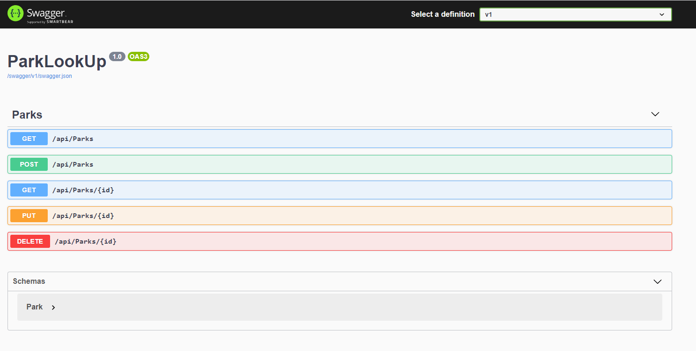
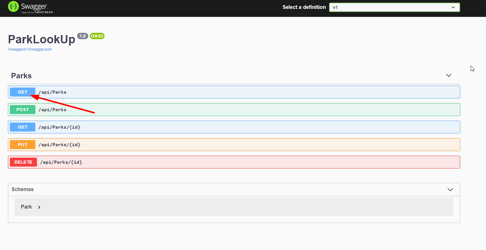
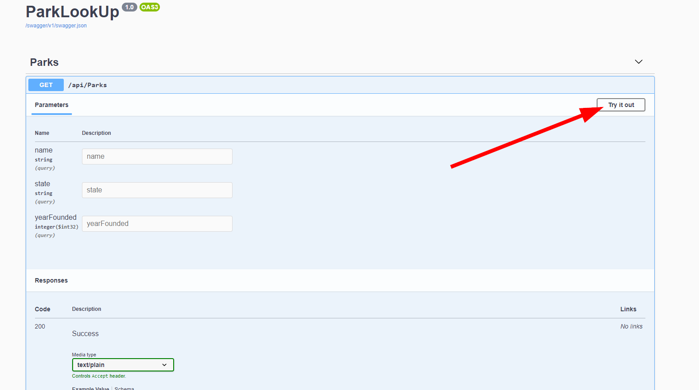
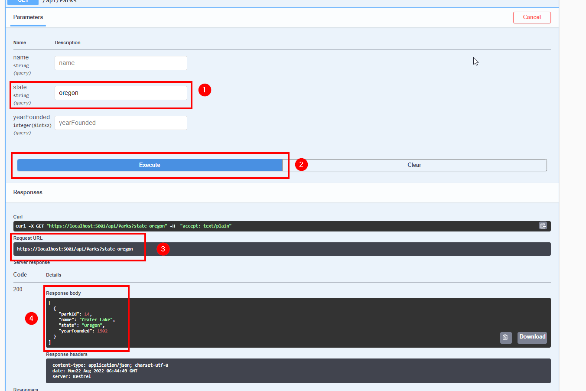

# National Park API

#### By Matt Wilkinson


_photo by Hendrik Cornelissen_

#### A locally hosted API conating all 63 of the national parks in the United States. The API lists the name, state, and year it was founded. 

## Technologies Used

* C#
* .NET
* ASP.NET Core MVC
* Razor
* MySQL
* Markdown
* HTML
* CSS
* EF Core

## Description 

This application hosts an API that contains info of all the national parks in the United States. Built with C#/.NET Core. It also allows users to interact with the database using the swagger user interface. 

## Setup & Installation Requirements

* Download/Clone entire github file
* Enter the "ParkLooUp" directory using the command ```Cd ParkLookUp```
* In the root directory, confirm there is a .gitignore file and add the following

```js
*/obj
*/bin
*.vscode
*/appsettings.json
```

* To the .gitignore file. It will keep your repository clean of unnecessary files and protect your database from unauthorized access
* Create an appsetting.json file at the root directory
* Open the appsetting.json file and enter:

```js
{
  "Logging": {
    "LogLevel": {
      "Default": "Warning",
      "System": "Information",
      "Microsoft": "Information"
    }
  },
  "AllowedHosts": "*",
  "ConnectionStrings": {
    "DefaultConnection": "Server=localhost;Port=3306;database=[NAME OF YOUR DATABASE];uid=root;pwd=[YOUR PASSWORD];"
  }
}
```

* Run ```git add .gitignore```
* Commit your changes
* To ensure the project will run correctly download MySQL WorkBench
* Run ```dotnet tool install --global dotnet-ef --version 5.0.1``` at a global level
* Run the following from the project directory of ```ParkLookUp```
* Once all of the necessary setup is in place and we can successfully run dotnet build
* Run ```dotnet restore``` and ```dotnet build```
* Run ```dotnet ef migrations add Initial```
* Run the following command: ```dotnet ef database update```
* Run the following command: ```dotnet watch run```
* click on  <http://localhost:5000>


## Swagger

Click https://localhost:5001/swagger or copy/paste the link into the browser to get the swagger user interface.



You will see all the CRUD options for API. Click on the different options get/edit info from the API or to get the example code of how to perform that function.

* GET /api/Parks: Allows user to look a park by it's name, state, or year it was founded.

* POST /api/Parks: Allows user to add a new park to the database

* GET /api/Parks: Allows user to look up a park by it's parkID

* PUT /api/Parks: Allows user to edit an existing park in the datebase after it's ID is provided

* DELETE /api/Parks: Allows user to delete an existing park in the datebase after it's ID is provided

<br> 

### Using Swagger UI

<br> 



1st click one of the options. In this case we are going to click on GET /api/Parks

<br> 



You will then see an information. Click on "Try it out" in the right had corner in order to use that function.

<br> 



1. Enter a State in order to get a list of all the national parks in that state. If you enter in a name, or yearfounder it will fetch all the parks that meat that query.
2. Excute with fetch the information requested 
3. This shows the code that you would need to enter into the bowser to do the same API call
4. This displays all the data that was requested above. In this case it showing all the national parks in oregon. 

<br> 

## Known Bugs

* None


## License

Copyright (c) 2022 Matt Wilkinson

Permission is hereby granted, free of charge, to any person obtaining a copy
of this software and associated documentation files (the "Software"), to deal
in the Software without restriction, including without limitation the rights
to use, copy, modify, merge, publish, distribute, sublicense, and/or sell
copies of the Software, and to permit persons to whom the Software is
furnished to do so, subject to the following conditions:

The above copyright notice and this permission notice shall be included in all
copies or substantial portions of the Software.

THE SOFTWARE IS PROVIDED "AS IS", WITHOUT WARRANTY OF ANY KIND, EXPRESS OR
IMPLIED, INCLUDING BUT NOT LIMITED TO THE WARRANTIES OF MERCHANTABILITY,
FITNESS FOR A PARTICULAR PURPOSE AND NONINFRINGEMENT. IN NO EVENT SHALL THE
AUTHORS OR COPYRIGHT HOLDERS BE LIABLE FOR ANY CLAIM, DAMAGES OR OTHER
LIABILITY, WHETHER IN AN ACTION OF CONTRACT, TORT OR OTHERWISE, ARISING FROM,
OUT OF OR I
  
